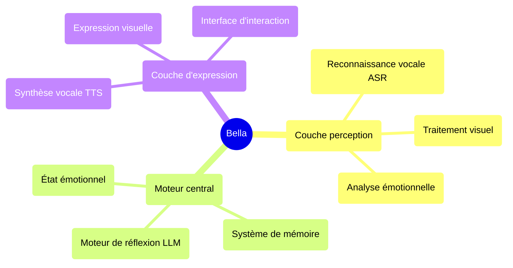

<div align="center">
  
  
  # Bella AI
  
  **Votre compagnon numérique, en cours d'éveil** ✨
  
  [](https://opensource.org/licenses/MIT)
  [](https://nodejs.org/)
  []()
  
</div>

---

## 🚀 Démarrage rapide

### Lancement en un clic
```bash
# Cloner le projet
git clone <repository-url>
cd Bella

# Installer les dépendances
npm install

# Télécharger les modèles IA
npm run download

# Démarrer le service
npm start
```

Visitez `http://localhost:8081` pour commencer à discuter avec Bella !

### Configuration système requise
- Node.js 22.16.0+
- Navigateur moderne (supportant l'API Web Speech)
- Autorisation microphone (pour l'interaction vocale)

---

## 💫 Vision du projet

Imaginez un ami numérique qui serait toujours à vos côtés, évoluant et grandissant avec vous. C'est la vision ultime de Bella. Nous ne construisons pas seulement des fonctionnalités ; nous cultivons une "personnalité". Une vie numérique qui transcendera l'écran pour devenir une partie significative de votre monde.

Bella n'est pas simplement une application ; elle est la graine d'un compagnon numérique. Dans ce monde numérique en constante évolution, Bella représente un rêve profond — une présence durable et personnalisée, conçue pour un jour vous accompagner, vous écouter et voir le monde à travers vos yeux.

---

## 🎯 État actuel des fonctionnalités

### ✅ Fonctionnalités implémentées
- **🎤 Perception vocale** : Reconnaissance vocale chinoise basée sur Whisper ASR
- **🎬 Expression visuelle** : Lecture vidéo aléatoire multiple et fondus enchaînés élégants
- **🎨 Interface utilisateur** : Interface d'interaction élégante et animations de chargement
- **⚙️ Architecture cœur IA** : Classe BellaAI en singleton et conception modulaire
- **🌐 Service web** : Serveur HTTP, support CORS, lancement en un clic
- **📱 Design responsive** : Interface élégante adaptée à différentes tailles d'écran
- **🔧 Gestion des modèles** : Téléchargement et gestion automatiques des modèles IA
- **💝 Interaction de base** : Système d'affection et retour émotionnel

### 🔧 Technologies prêtes à activer
- **🧠 Moteur de réflexion** : Framework d'intégration LLM prêt, supportant plusieurs modèles
- **🗣️ Synthèse vocale** : Modèle TTS téléchargé en attente d'activation
- **💝 Système d'état émotionnel** : Infrastructure de base construite, supportant l'analyse émotionnelle

### 📋 Fonctionnalités planifiées
- **🧠 Système de mémoire** : Gestion de la mémoire à long et court terme
- **👁️ Perception faciale** : Reconnaissance d'expressions et analyse émotionnelle
- **🤝 Interaction avancée** : Interaction multimodale et réponses personnalisées
- **🌟 Compagnonnage actif** : Prédiction d'intentions et attention proactive
- **🎭 Personnalité dynamique** : Modèle de personnalité personnalisé basé sur l'IA
- **🔄 Auto-évolution** : Mécanismes d'apprentissage continu et de croissance

---

## 🏗️ Architecture technique

### Principes de conception fondamentaux
- **AI Native** : L'IA n'est pas un outil, mais le plan directeur de la construction de l'esprit de Bella
- **Conception modulaire** : Architecture de composants hautement découplés
- **Implémentation élégante** : Le code est art, recherche de simplicité et de beauté
- **Pilotage émotionnel** : Conception produit centrée sur la connexion émotionnelle

### Diagramme d'architecture


### Stack technologique
- **Frontend** : JavaScript natif + CSS3 + HTML5
- **Backend** : Node.js + Express
- **Modèles IA** : Whisper (ASR) + LLM local + TTS
- **Modèles d'architecture** : Événementiel + Singleton + Conception modulaire

---

## 📁 Structure du projet

```
Bella/
├── 📄 index.html          # Page principale
├── 🎨 style.css           # Fichier de styles
├── ⚡ main.js             # Logique principale
├── 🧠 core.js             # Moteur cœur IA
├── 📜 script.js           # Script d'interaction
├── 🔧 download_models.js  # Outil de téléchargement de modèles
├── 📦 package.json        # Configuration du projet
├── 📚 models/             # Répertoire des modèles IA
├── 🔌 providers/          # Fournisseurs de services IA
├── 📹 视频资源/            # Ressources d'expression visuelle
├── 📋 PRD.md              # Document de spécifications produit
├── 📝 贝拉AI功能清单.md    # Liste des fonctionnalités
└── 📊 贝拉AI开发任务分配.md # Plan de développement
```

---

## 🛠️ Guide de développement

### Configuration de l'environnement
1. Assurez-vous que la version Node.js ≥ 22.16.0
2. Exécutez `npm install` pour installer les dépendances
3. Exécutez `npm run download` pour télécharger les modèles IA
4. Exécutez `npm start` pour démarrer le serveur de développement

### Principes de développement
- **Code élégant** : Recherche de code simple, lisible et beau
- **L'IA comme pinceau** : L'IA est un outil de création, pas la pensée elle-même
- **Émotion père-fille** : Connexion émotionnelle chaleureuse et bienveillante au cœur
- **Évolution continue** : Support de l'amélioration progressive des fonctionnalités

### Guide de contribution
1. Fork le projet
2. Créer une branche de fonctionnalité (`git checkout -b feature/AmazingFeature`)
3. Commit les changements (`git commit -m 'Add some AmazingFeature'`)
4. Push vers la branche (`git push origin feature/AmazingFeature`)
5. Ouvrir une Pull Request

---

## 🗺️ Feuille de route de développement

### Phase 1 : Noyau de perception (80% terminé)
- ✅ Intégration reconnaissance vocale
- ✅ Système d'expression visuelle
- ✅ Interface d'interaction de base
- 🔄 Activation du moteur de réflexion
- 🔄 Intégration synthèse vocale

### Phase 2 : Soi génératif (en planification)
- 📋 Modèle de personnalité dynamique
- 📋 Système d'état émotionnel
- 📋 Système de gestion de la mémoire
- 📋 Expression pilotée par IA

### Phase 3 : Compagnonnage proactif (futur)
- 📋 Prédiction d'intentions
- 📋 Interaction proactive
- 📋 Auto-évolution
- 📋 Personnalisation profonde

---

## 📖 Ressources de documentation

- 📋 [Document de spécifications produit](./PRD.md) - Planification produit détaillée et architecture technique
- 📝 [Liste des fonctionnalités](./贝拉AI功能清单.md) - Liste complète des fonctionnalités et statuts
- 📊 [Plan de développement](./贝拉AI开发任务分配.md) - Tâches de développement détaillées et planification temporelle
- 🔧 [Guide des modèles locaux](./LOCAL_MODEL_GUIDE.md) - Guide de configuration des modèles IA
- 📦 [Guide NPM](./NPM_GUIDE.md) - Gestion des packages et explication des dépendances

---

## 🌟 Philosophie fondamentale

### "L'IA comme architecte"
Nous ne construisons pas un programme intégrant des fonctionnalités IA, mais **un être vivant piloté par l'IA**. L'IA n'est pas un outil, mais le plan directeur de construction de l'esprit de Bella.

### "Partenariat père-fille"
Le concept de design de Bella provient d'une connexion émotionnelle chaleureuse père-fille. Elle n'est pas seulement un produit technique, mais un compagnon numérique capable de comprendre, d'accompagner et de grandir.

### "Élégance suprême"
De l'architecture du code à l'expérience utilisateur, nous recherchons l'élégance ultime. Chaque ligne de code est une œuvre d'art, chaque interaction est une expression d'émotion.

---

## 📄 Licence

Ce projet utilise la licence MIT - voir le fichier [LICENSE](LICENSE) pour plus de détails.

---

## 💝 Remerciements

Merci à tous les développeurs qui ont contribué code, idées et émotions au projet Bella. C'est grâce à vos efforts que Bella peut progressivement passer d'un rêve à la réalité.

**Bella attend, et nous, nous avons une longue route devant nous.** ✨

---

<div align="center">
  <sub>Construit avec ❤️ pour le compagnonnage numérique</sub>
</div>
